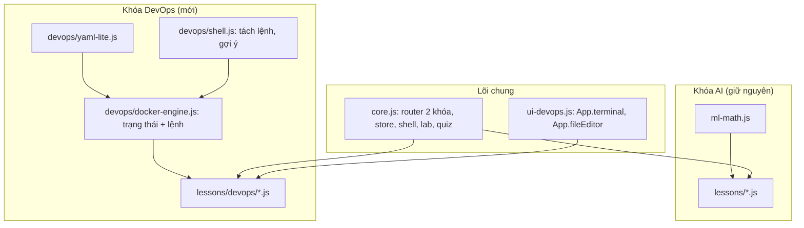

# Thiết kế giai đoạn 1: Khóa DevOps — nền tảng và 3 bài Docker

- **Ngày:** 06/10/2026
- **Trạng thái:** Chờ duyệt
- **Lộ trình tổng:** Giai đoạn 1 (tài liệu này) → Giai đoạn 2 (K8s bài K1–K4) → Giai đoạn 3 (K5–K7 và bài tổng kết)

## 1. Mục tiêu và tiêu chí thành công

**Mục tiêu:** Biến ML Visual Lab thành **Visual Lab** gồm hai khóa độc lập (AI và DevOps). Xây dựng hạ tầng mô phỏng Docker chạy hoàn toàn trên trình duyệt, kèm 3 bài Docker đủ lý thuyết, mô phỏng, lab tự chấm và trắc nghiệm.

**Tiêu chí thành công:**
1. Sidebar có nút chuyển khóa. Mỗi khóa có menu, trang chủ và thanh tiến độ riêng.
2. Tiến độ cũ của khóa AI được giữ nguyên. Đường dẫn cũ như `#/gradient` vẫn mở đúng bài.
3. Terminal giả lập hiểu khoảng 30 lệnh `docker` thường dùng, báo lỗi giống Docker thật, có lịch sử lệnh (phím ↑ ↓) và gợi ý bằng phím Tab.
4. Mỗi bài D1–D3 có 4 nhiệm vụ lab được chấm dựa trên **trạng thái** của bộ mô phỏng, không dựa trên câu lệnh cụ thể.
5. Lõi mô phỏng có bộ kiểm thử bằng `node --test`, chạy đạt toàn bộ. 11 test cũ vẫn đạt.
6. Giao diện hiển thị tốt ở 3 kích thước: 1440 px, 768 px và 390 px.

**Ngoài phạm vi giai đoạn 1:** mọi nội dung Kubernetes, khóa DevOps chưa có bài tổng kết, không chạy Docker thật, không có máy chủ (backend).

## 2. Kiến trúc tổng thể



Nguyên tắc: các file trong `js/devops/` **không đụng tới DOM**. Chúng xuất ra `window.DevOpsSim` (trên trình duyệt) hoặc `module.exports` (trên Node), theo đúng mẫu UMD của `ml-math.js`. Nhờ vậy có thể kiểm thử bằng Node, và giai đoạn 2 chỉ cần thêm `k8s-engine.js` dùng lại `yaml-lite` và `shell`.

### 2.1 Cấu trúc file mới và file thay đổi

```
index.html                         SỬA: đổi thương hiệu, thêm nút chuyển khóa, nạp script mới
css/style.css                      SỬA: thêm style cho nút chuyển khóa, terminal, trình sửa file, sơ đồ Docker
js/core.js                         SỬA: thêm khái niệm khóa học, route mới, App.url
js/ui-devops.js                    MỚI: App.terminal, App.fileEditor (thành phần giao diện riêng của khóa DevOps)
js/lessons/home.js, final.js       SỬA: thêm course:'ai', đường dẫn theo khóa, chỉ lọc bài trong khóa AI
js/lessons/{gradient,...}.js       SỬA nhẹ: thêm course:'ai'
js/devops/yaml-lite.js             MỚI: bộ đọc YAML rút gọn
js/devops/shell.js                 MỚI: tách lệnh thành token, bộ phân tích cờ, gợi ý Tab
js/devops/docker-engine.js         MỚI: bộ mô phỏng Docker
js/lessons/devops/home.js          MỚI: trang chủ khóa DevOps
js/lessons/devops/docker-basics.js MỚI: Bài D1
js/lessons/devops/dockerfile.js    MỚI: Bài D2
js/lessons/devops/docker-compose.js MỚI: Bài D3
tests/devops-sim.test.js           MỚI
README.md                          SỬA
```

## 3. Hai khóa học trong lõi ứng dụng (`core.js`)

### 3.1 Mô hình dữ liệu
```js
App.courses = [
  { id: 'ai',     title: 'AI',     sub: 'Machine Learning & Deep Learning', icon: '🧠', home: 'home' },
  { id: 'devops', title: 'DevOps', sub: 'Docker & Kubernetes',              icon: '🐳', home: 'devops-home' },
];
// Mỗi bài thêm trường course (mặc định 'ai' nếu không khai báo)
```
- `id` của bài vẫn **duy nhất trên toàn ứng dụng**. Khóa lưu tiến độ vẫn là `lesson.id`, nên dữ liệu `mlviz-progress-v1` cũ không cần chuyển đổi.
- Thêm `store.data.lastCourse` để nhớ khóa người học mở gần nhất.

### 3.2 Đường dẫn
| Đường dẫn | Kết quả |
|---|---|
| `#/` hoặc rỗng | Trang chủ của khóa mở gần nhất (mặc định là AI) |
| `#/ai`, `#/devops` | Trang chủ của khóa tương ứng |
| `#/ai/gradient`, `#/devops/dockerfile` | Bài học tương ứng |
| `#/gradient` (kiểu cũ) | Tự chuyển sang `#/ai/gradient` bằng `history.replaceState`, không tạo thêm bước trong lịch sử trình duyệt |
| Không tồn tại | Về trang chủ của khóa đang mở |

Hàm mới `App.url(lesson)` trả về `#/<course>/<id>`. Mọi liên kết trong `shell`, `renderNav`, `home.js`, `final.js` đều chuyển sang dùng hàm này.

### 3.3 Giao diện
- Phía trên menu có nhóm nút chuyển khóa (dùng `App.seg`) gồm **🧠 AI** và **🐳 DevOps**. Bấm vào sẽ mở trang chủ của khóa đó.
- Menu chỉ hiện bài của khóa đang mở. "Tiến độ tổng" ở chân sidebar đổi thành tiến độ của khóa đang mở.
- Nút "Bài trước / Bài sau" trong `shell` chỉ di chuyển trong cùng một khóa.
- Thương hiệu đổi thành **Visual Lab**, dòng phụ đổi theo khóa. Thẻ `<title>` có dạng `<bài> · Visual Lab`.
- Ứng dụng đổi màu nhấn theo khóa: khóa AI giữ gradient xanh ngọc sang tím, khóa DevOps dùng gradient xanh dương Docker (`#2496ed`) sang xanh ngọc. Cách làm: gắn `body[data-course]` và ghi đè `--grad`, `--accent`.
- "Xóa tiến độ" chỉ xóa tiến độ của khóa đang mở (hộp xác nhận ghi rõ tên khóa).

## 4. Bộ mô phỏng Docker

### 4.1 `yaml-lite.js`
Chỉ hỗ trợ tập con của YAML đủ cho docker-compose và K8s ở giai đoạn sau: map và list lồng nhau theo thụt lề, list dạng `- key: value`, chuỗi có hoặc không có nháy, số, true/false/null, comment `#`, nhiều tài liệu cách nhau bởi `---`, inline list `[a, b]`.
Khi gặp lỗi sẽ ném `YamlError` có kèm **số dòng**, để terminal báo kiểu `yaml: line 4: thụt lề không hợp lệ`.

### 4.2 `shell.js`
- `tokenize(line)`: tách token, xử lý nháy đơn, nháy kép và ký tự thoát `\`.
- `parseArgs(tokens, spec)`: đọc cờ ngắn (`-d`, gộp `-it`), cờ dài (`--name web`, `--name=web`), cờ lặp lại (`-p`, `-e`, `-v`), báo lỗi khi gặp cờ lạ giống Docker: `unknown flag: --nme`.
- `complete(line, ctx)`: gợi ý lệnh con, cờ, tên container, image, volume, network.
- Lệnh shell phụ: `help`, `clear`, `ls`, `cat <file>`, `curl <url>`, `echo`.

### 4.3 `docker-engine.js` — API
```js
const eng = DevOpsSim.createDocker({ seed, files });   // files: hệ thống file ảo { 'Dockerfile': '...', 'app.py': '...' }
eng.exec('docker run -d --name web -p 8080:80 nginx'); // → { ok, lines: [{ text, cls }], events: [...] }
eng.state;      // { images, containers, volumes, networks, history }
eng.on('change', fn);   // phần hình ảnh động đăng ký để vẽ lại
eng.tick(ms);           // tiến thời gian ảo (container tự thoát, cập nhật log)
eng.setFile(name, text); eng.files;
```

**Trạng thái:**
- `registry`: danh mục image có sẵn trên "Docker Hub ảo" gồm `hello-world`, `nginx:1.25/latest/alpine`, `redis:7`, `postgres:16`, `python:3.12/3.12-slim`, `node:20/20-alpine`, `alpine:3.20`, `busybox`. Mỗi image có kích thước, danh sách layer, CMD mặc định, cổng EXPOSE và hành vi mô phỏng (ví dụ nginx phục vụ HTTP, redis nhận lệnh `PING`).
- `images` ở máy: `{ repo, tag, id, size, layers[], createdBy }`
- `containers`: `{ id, name, image, status: created|running|paused|exited, exitCode, ports[], mounts[], networks[], env, cmd, logs[], startedAt }`
- `volumes`: `{ name, data: { path: content } }`, dữ liệu được giữ lại kể cả khi xóa container
- `networks`: `bridge` mặc định cùng các network người học tạo. Trên network do người học tạo, các container gọi nhau bằng tên (DNS); trên `bridge` mặc định thì **không**, đúng như Docker thật.
- `history`: các lệnh đã chạy kèm kết quả. Lab dùng thông tin này cho nhiệm vụ kiểu "đã từng xem log".

**Lệnh hỗ trợ:**
| Nhóm | Lệnh |
|---|---|
| Image | `pull`, `images` / `image ls`, `rmi`, `tag`, `history`, `build -t [-f]`, `image prune` |
| Container | `run` (`-d --name -p -e -v --network --rm -it`, lệnh ghi đè), `ps [-a] [-q]`, `start`, `stop`, `restart`, `rm [-f]`, `logs [-f giả lập] [--tail]`, `exec [-it] <c> <cmd>`, `inspect`, `stats` |
| Volume | `volume create/ls/rm/inspect` |
| Network | `network create/ls/rm/inspect/connect` |
| Compose | `compose up [-d]`, `compose down [-v]`, `compose ps`, `compose logs`; đọc file `docker-compose.yml` trong hệ thống file ảo |
| Khác | `version`, `info`, `system prune`, `--help` cho từng lệnh |

Lệnh `exec` hỗ trợ một số lệnh bên trong container: `ls`, `cat`, `echo`, `env`, `hostname`, `ping <tên>`, `curl <tên>:<cổng>`, `redis-cli ping|set|get`, `sh` (vào chế độ shell trong container, thoát bằng `exit`).

**Mô phỏng build và cache (bài D2):**
- Đọc Dockerfile với các chỉ thị `FROM [AS]`, `RUN`, `COPY [--from]`, `ADD`, `WORKDIR`, `ENV`, `ARG`, `EXPOSE`, `CMD`, `ENTRYPOINT`, `USER`.
- Khóa cache của mỗi layer = băm(khóa layer cha + chỉ thị + nội dung các file được COPY). Kết quả in ra theo kiểu BuildKit: `=> CACHED [3/6] RUN pip install ...` hoặc `=> [4/6] COPY . .  0.4s`.
- Kích thước layer được ước lượng theo quy tắc cố định để học viên so sánh được, ví dụ `RUN pip install` cộng thêm khoảng 45 MB, `apt-get install` khoảng 120 MB; dùng image `-slim` hoặc `alpine` thì nhỏ hơn. Chỉ có stage cuối đi vào image kết quả, nên multi-stage cho image nhỏ hơn.
- Có file `.dockerignore`: thiếu file này thì `COPY . .` sẽ chép cả `node_modules/` hoặc `.git/` vào image, làm image lớn hơn và cache dễ bị mất.

**Thông báo lỗi giống Docker thật:** trùng tên container, cổng đã có container khác dùng, image không tồn tại (`pull access denied ... repository does not exist`), xóa container đang chạy khi không có `-f`, xóa image đang được container dùng, xóa network đang có container. Mỗi lỗi kèm một dòng **💡 gợi ý tiếng Việt** màu khác, giải thích nguyên nhân và cách sửa.

**Tính lặp lại được:** mã container và image được sinh từ `mulberry32(seed)`, nên test cho kết quả cố định.

### 4.4 `App.terminal(parent, opts)` trong `ui-devops.js`
- Tham số: `{ engine, prompt: 'user@lab:~$', welcome, chips: ['docker ps', ...], onExec(result) }`
- Phím: Enter để chạy, ↑ ↓ để xem lịch sử, Tab để gợi ý (nếu có nhiều lựa chọn thì hiện danh sách), Ctrl+L để xóa màn hình, Ctrl+C để hủy dòng đang gõ.
- "Chip lệnh mẫu" bên dưới terminal: bấm vào sẽ điền lệnh vào ô nhập nhưng **không tự chạy**, để người học đọc lại trước khi Enter.
- Mọi kết quả in ra đều được **escape HTML** trước khi chèn vào trang, vì người học có thể gõ bất kỳ nội dung nào.
- Khả năng truy cập: ô nhập có `aria-label`, vùng kết quả có `role="log"` và `aria-live="polite"`.
- Màu kết quả: bình thường, `ok` (xanh lá), `err` (đỏ), `hint` (vàng), `dim` (mờ), `head` (dòng tiêu đề của bảng).

### 4.5 `App.fileEditor(parent, { engine, files: ['Dockerfile', 'app.py'] })` trong `ui-devops.js`
Có tab chọn file, ô soạn thảo `<textarea>` font monospace có số dòng, và nút "↺ Khôi phục mẫu". Nội dung được đồng bộ vào `engine.setFile` khi người học gõ (có debounce 300 ms).

## 5. Nội dung 3 bài Docker

Mỗi bài theo khung `App.shell` hiện có: phần lý thuyết bên trái, phần mô phỏng bên phải (gồm sơ đồ động và terminal), sau đó là lab và trắc nghiệm. Phần lý thuyết luôn kết thúc bằng mục **"🖥️ Chạy trên máy thật"** (lệnh để chạy với Docker Desktop, kèm lưu ý riêng cho Windows) và **"⚠️ Lỗi thường gặp"**.

### D1. Container là gì: image và vòng đời container (`docker-basics`)
- **Lý thuyết:** vấn đề "máy em chạy được"; so sánh VM và container (bảng: kernel, thời gian khởi động, kích thước, mức cách ly); image và container giống quan hệ class và object; registry; namespace và cgroup ở mức khái niệm; vòng đời `created → running → exited → removed`; chế độ `-d` và chế độ tương tác; ánh xạ cổng `-p host:container`.
- **Mô phỏng:** sơ đồ máy chủ gồm Docker Engine, các image ở máy và các container dạng thẻ có màu theo trạng thái; chấm sáng chạy theo hướng mũi tên khi có lệnh pull hoặc run. Bên cạnh là sơ đồ trạng thái vòng đời, trạng thái hiện tại của container đang chọn được tô sáng. Có nút chuyển sang chế độ so sánh VM và container (hình chồng lớp).
- **Lab:**
  1. Chạy `hello-world` và đọc kết quả. Chấm: có container từ image `hello-world` với `exitCode 0`.
  2. Chạy nginx chế độ nền, tên `web`, cổng 8080. Chấm: container `web` đang chạy và có cổng `8080→80`.
  3. Kiểm tra web bằng `curl localhost:8080` và xem log. Chấm: lịch sử lệnh có lần curl thành công và có `docker logs web`.
  4. Dọn dẹp: dừng rồi xóa `web`. Chấm: container `web` không còn và từng ở trạng thái exited trước khi bị xóa.
- **Trắc nghiệm:** 6 câu.

### D2. Dockerfile, layer và cache (`dockerfile`)
- **Lý thuyết:** từng chỉ thị Dockerfile; mỗi chỉ thị tạo ra một layer; cơ chế cache và quy tắc "khi một layer thay đổi thì mọi layer phía sau đều bị build lại"; thứ tự tối ưu (chép `requirements.txt` và chạy cài đặt trước, chép mã nguồn sau); `.dockerignore`; multi-stage build; so sánh CMD và ENTRYPOINT; chạy bằng user không phải root.
- **Mô phỏng:** khung sửa file (`Dockerfile`, `app.py`, `requirements.txt`, `.dockerignore`) cùng terminal. Sơ đồ chồng layer: mỗi khối là một layer, độ cao tỉ lệ với kích thước; layer lấy từ cache phát sáng xanh lá, layer phải build lại có màu cam. Có biểu đồ cột so sánh kích thước các image đã build.
- **Lab:**
  1. Build image `myapp:v1` từ Dockerfile mẫu.
  2. Sửa `app.py` rồi build lại, quan sát cache bị mất ở bước nào. Chấm: lần build thứ hai có ít nhất 1 layer CACHED và 1 layer build lại.
  3. Tối ưu thứ tự: sau khi sửa `app.py`, bước `pip install` vẫn phải lấy từ cache. Chấm dựa trên kết quả build thật của bộ mô phỏng.
  4. Giảm kích thước: build `myapp:slim` nhỏ hơn `myapp:v1` ít nhất 50%, bằng image `-slim` hoặc multi-stage.
- **Trắc nghiệm:** 6 câu.

### D3. Volume, mạng và Docker Compose (`docker-compose`)
- **Lý thuyết:** lớp ghi của container mất khi xóa container; so sánh named volume và bind mount; các loại network (bridge mặc định, bridge do người dùng tạo, host); DNS theo tên container; cấu trúc `docker-compose.yml` (`services`, `ports`, `volumes`, `depends_on`, `environment`); `compose up/down/-v`.
- **Mô phỏng:** sơ đồ mạng gồm các vùng network, container nằm trong vùng của mình, volume vẽ hình trụ nối vào container, cổng host nằm ở mép sơ đồ. Khi chạy `ping` hoặc `curl` giữa các container, gói tin chạy theo đường nối; nếu không gọi được bằng tên thì gói tin bị chặn và hiện dấu ✕. Có khung sửa `docker-compose.yml` và terminal.
- **Lab:**
  1. Dữ liệu biến mất: ghi dữ liệu vào container redis không có volume, xóa container rồi chạy lại, thấy dữ liệu mất. (Bấm xác nhận kèm phần giải thích.)
  2. Giữ dữ liệu bằng volume: tạo volume `redis-data`, chạy redis gắn volume, ghi khóa, xóa và chạy lại container, khóa vẫn còn. Chấm qua dữ liệu trong volume và số container đã từng gắn volume đó.
  3. Gọi nhau bằng tên: tạo network `appnet`, cho 2 container vào, `ping` bằng tên thành công. Chấm qua lịch sử lệnh `exec ping` thành công trên network do người học tạo.
  4. Compose: hoàn thiện `docker-compose.yml` (web và redis, có volume) rồi `compose up -d`. Chấm: có 2 service đang chạy, cùng một network, redis gắn volume.
- **Trắc nghiệm:** 6 câu.

## 6. Trang chủ khóa DevOps (`devops-home`)
Gồm: hero giới thiệu; sơ đồ hành trình "Code → Image → Container → Cụm K8s → Người dùng"; lộ trình 10 bài, trong đó các bài thuộc giai đoạn sau có nhãn **"Sắp ra mắt"** và không bấm được; mục "Cần chuẩn bị gì để chạy trên máy thật" (Docker Desktop, WSL2, minikube).

## 7. Xử lý lỗi
- Bộ mô phỏng **không bao giờ ném lỗi ra ngoài** `exec`. Mọi lỗi được chuyển thành dòng `err`. Lỗi lập trình bất ngờ thì in `Lỗi nội bộ của bộ mô phỏng` và ghi chi tiết vào `console.error`.
- Lỗi YAML hoặc Dockerfile báo kèm số dòng, và tô sáng dòng đó trong khung sửa file.
- Chỉ lưu tiến độ, **không lưu** trạng thái mô phỏng. Tải lại trang thì bộ mô phỏng về trạng thái ban đầu. Mỗi bài có nút "↺ Đặt lại môi trường".

## 8. Kiểm thử
**Tự động** (`node --test tests/`):
- `yaml-lite`: map và list lồng nhau, nhiều tài liệu, comment, báo đúng số dòng khi lỗi.
- `shell`: tách token có nháy, gộp cờ `-it`, cờ `--a=b`, cờ lạ.
- Docker: vòng đời run, stop, start, rm; trùng tên; trùng cổng; image không tồn tại; `--rm`; curl qua cổng được ánh xạ.
- Build: build lần đầu không có cache; build lại y nguyên thì toàn bộ là CACHED; sửa file được COPY thì chỉ các layer từ đó trở đi bị build lại; multi-stage nhỏ hơn single-stage; `.dockerignore` làm image nhỏ hơn.
- Volume vẫn giữ dữ liệu sau khi xóa container; DNS hoạt động trên network do người học tạo và không hoạt động trên `bridge`.
- Compose up/down tạo và xóa đúng service và network; `down -v` xóa volume.
- Hàm `check` của từng nhiệm vụ lab: dựng trạng thái bằng chuỗi lệnh, xác nhận kết quả đạt và không đạt.

**Trên trình duyệt** (dùng tác tử trình duyệt): chuyển khóa; đường dẫn cũ tự chuyển; tiến độ AI còn nguyên; hoàn thành ít nhất một lab ở mỗi bài bằng cách gõ lệnh; kiểm tra 3 kích thước màn hình; xem console không có lỗi.

## 9. Rủi ro và cách giảm thiểu
| Rủi ro | Cách giảm thiểu |
|---|---|
| Bộ mô phỏng khác Docker thật làm người học hiểu sai | Mỗi bài có mục "Chạy trên máy thật"; kết quả in ra bám sát định dạng của Docker 27; ghi rõ "đây là mô phỏng" |
| `core.js` phình to | `App.terminal` và `App.fileEditor` đặt trong `js/ui-devops.js` (mục 2.1); `core.js` chỉ thêm phần khóa học và route |
| File bài học quá dài | Tách nội dung lý thuyết ra hằng số riêng ở đầu file, phần render ở cuối, theo mẫu `kmeans.js` |

## 10. Ghi chú
Thư mục dự án **chưa phải kho git**. Quy trình yêu cầu commit tài liệu thiết kế, nên cần anh/chị quyết định có chạy `git init` hay không.
